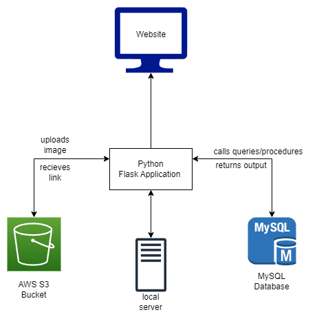
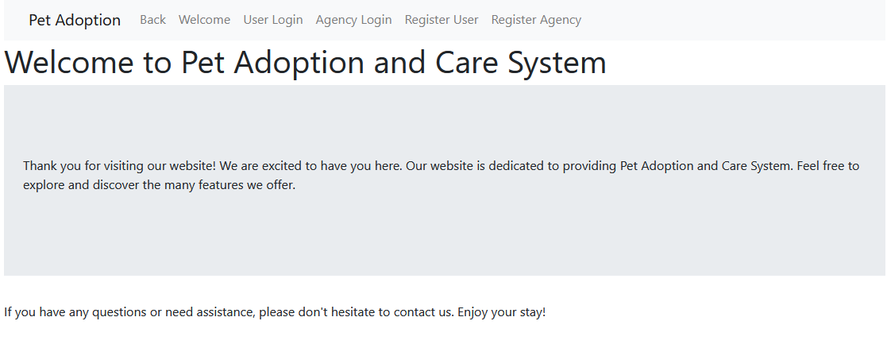
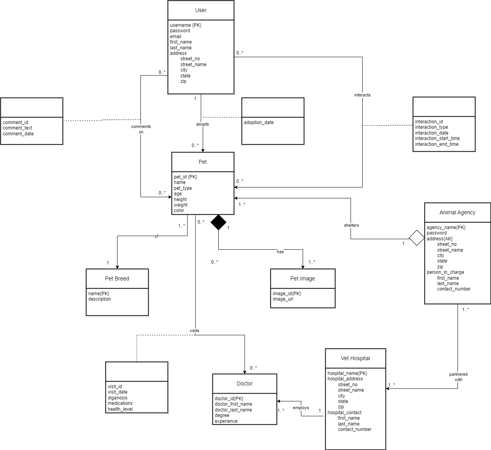
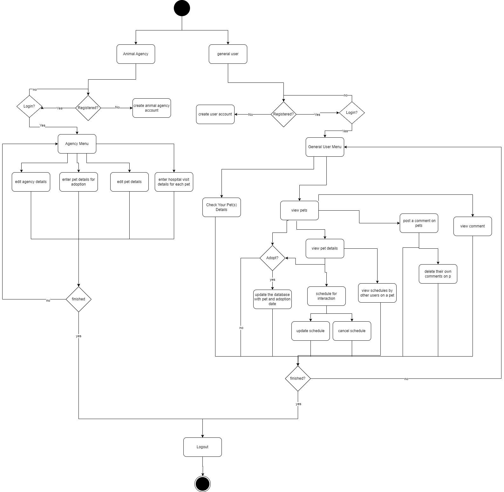
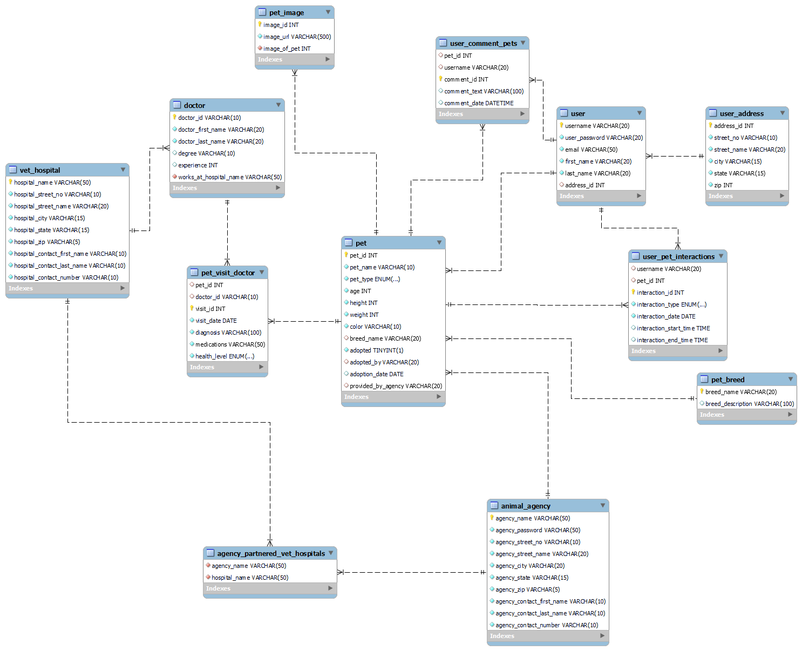

# Pet Adoption and Care System

Final Project submission towards DBMS CS5200 Fall 2023 Section 2 : Kathleen Durant \
Done by: **Aakash Mahesha** and **Samanvya Tripathi**

## Tech Stack
- [Python](https://www.python.org/downloads/release/python-3918/) v3.9.18
- [Bootstrap 4.0](https://getbootstrap.com/docs/4.6/getting-started/introduction/) (served statically)
- [MySQL Community Server](https://www.mysql.com/) - GPL v8.0.34
- [Flask](https://flask.palletsprojects.com/en/3.0.x/) v3.0.0
- [pymysql](https://pypi.org/project/pymysql/) v1.1.0
- [boto3](https://pypi.org/project/boto3/) v1.33.6 
- [aws cli](https://docs.aws.amazon.com/cli/latest/userguide/getting-started-install.html)  v2 

Here are the main libraries and software we used for our project (other dependencies are installed automatically by pip/conda). It is a Python Flask backend with a HTML+Bootstrap frontend, MySQL for the Relational Database and pymysql acting as the bridge between python and our mysql database. Since we had images involved, we used AWS S3 to upload them and then store their URLs in the Database, hence the `boto3` and `aws cli`. AWS CLI needs to be configured with your Account Access ID and Keys. Except AWS CLI library, all other are installed via conda/pip.

## Expected Installation Directories
Pip/Conda generally install the software in their respective installation directories.

## Running the Project

1. Installing required libraries: \
    `pip install -r environment_pip.txt` \
    Run This command within the main folder which contains this text file. If you are using conda, use this instead: \
    `conda env create -f environment.yml`

2. To install the other required library, AWS CLI, please use this [GUIDE](https://docs.aws.amazon.com/cli/latest/userguide/getting-started-install.html).

3. After installing AWS CLI, please configure it with your credentials from the AWS Dashboard. [Kindly contact us if you want the AWS Keys]

4. Get the required data from the MySQL dump of our database which contains the required schema, data, procedures, functions, triggers etc. Import it with 'pacs_dump.sql' file in the main project directory.

4. Get into the `code` directory which contains our main module `pacs`. We need to run this module with `python -m pacs`. Make sure your environment is activated/you have all the libraries set-up.

5. This should start the app, open this link on your browser: `http://127.0.0.1:5000`

    
    It should look something like this.

6. From here, you can create a user/agency profile or login to the existing ones and manage your pets and everything about your pet.

## Conceptual Design

The database for the "Pet Adoption and Care System" is designed to facilitate a comprehensive and immersive virtual pet adoption experience. The core entities in this system include User, Pet, Animal Agency (like Blue Cross), Vet Hospital, Doctor, Pet Breeds, Pet Images.  

Each User is uniquely identified by a User ID and has associated attributes such as username(unique), password, eamil, name (First, Last), and Address (street_no, street_name, city, state,zip). Multiple users can have the same address. Users can adopt 1 or more Pets but each pet can only be adopted by one user.  

The System contains multiple Animal Agencies which shelter these animals, till the time they are adopted. A Pet (animal) is sheltered by only one Agency which has a unique agency name, a unique address (street_no, street_name, city, state, zip), and a person-in-charge (first name, last name, contact). An agency can shelter one to many pets(animals).  

Whenever a pet agency registers itself to our pet adoption and care system, it must partner with 1 or many Vet hospitals that are provided by our system. The Entity Vet Hospital consists of following attributes: hospital_name (unique), hospital address (street_no, street_name, city, state, zip) and hospital contact (first_name, last_name and contact_number). Each hospital can be partnered with 1 to many animal agencies.  

Our pet agency and care system also tracks the doctors who work at the hospitals that treat pets. The Doctor entity consists of doctor_id which is unique, doctor_first_name, doctor_last_name, degree and experience. At a vet hospital, multiple doctors can be employed but each doctor can work at only one hospital.  

Each Pet is characterized by a Pet ID and attributes like Name, Type (dog, cat, bird, rodent), Age, height, weight, color and Health Level. When a User adopts a pet, the adoption date will be stored in the database. Also, each Pet belongs to a specific breed. Each breed has a unique name and description. There can be multiple animals of the same breed.  

The system also stores pictures of each pet uploaded by the agency. The Pet image entity consists of attributes such as image_id (unique) and URL of the image that is stored in remote storage services. Each pet can have 1 to many images but each image is of only one pet.  

The user can schedule interactions with pets through the pet adoption and care system. Interaction with a pet would help the user understand the pet and come to a decision whether to adopt the pet or not. Each interaction scheduled by a user with a pet is recorded in the database with the following attributes: unique interaction_id, interaction_type(Play, Feed, Pet), interaction_date, interaction_start_time and interaction_end_time. Each user can schedule an interaction with 0 to many pets and each pet can be scheduled for an interaction with 0 to many users.  

The users are allowed to view the pet profiles and comment on the pictures posted of them. Each user can post 0 to many comments on a particular pet. The comments are recorded with the following information: comment_id, comment_text, comment_date. Each pet can be commented on with 0 to many users.  

The agency is responsible for updating the system with the recent doctor’s visit of a pet. Each visit’s details are stored as follows: visit_id (unique), visit_date, diagnosis, medication, health_level(Great, Good, Moderate, Need Care). Each pet can have 0 to many visits with a doctor and each doctor can treat 0 to many pets.  

## UML Design

## Activity Diagram

## Technical Deep-Dive and Specifications

### Frontend
HTML pages (templates) were created to view the information and provide a way for user to perform CRUD operations. `Flask` uses `Jinja` to use python within the HTML pages and perform operations without Javascript. We have used this to populate the data coming from the backend and database. You can find the HTML templates in `/code/pacs/templates`. They are segregated into various folders depending on the type of template it is.    
Bootstrap 4.0 is used to beautify our website and make it look more presentable.

### Backend
We have Flask managing our routes, so whenever we go to "localhost:5000/" it finds the "/" route and calls the function that is coded alongside it. Similarly, we have routes which define the function they are for, like `/agency_login`, `/user_login` to distinguish which page to load, and which function to call. To view pet details, we have a route like `/adoption/pet/33` where 33 is the ID of the pet. Route names are all logical and describe efficiently what they are supposed to do. The code is organized into `/code/pacs/views` and each entity essentially has it own views which contain the various CRUD operations pertaining to that entity. Here is also where you will find a lot of the MySQL calls made to `SELECT`, `INSERT`, `UPDATE`, `DELETE` alongside various procedure calls.    
We also have an external connection to AWS S3, since we didn't want to store our images on the MySQL DB. Pet images can be uploaded by the agency/user and they are actually stored in the S3 bucket defined for this project, and only the URL to the image is stored in our DB schema. This ensures efficiency and de-coupling. 
 
We have some config files which store the Password for MySQL which you can edit and add yours to.

### MySQL
We have used a relational database to store our data related to pets, users, hospitals, pet agencies. We found this to be more suitable for our project's structure and constraints. The course has taught us a lot about MySQL so we also wanted to put our skills to the test, and we designed a database with 12 tables all very interconnected with each other. Here is a snapshot.

## Lessons Learned
- **Technical Expertise Gained:**
    1. Designing a database schema for a big and complicated use-case like tracking pets up for adoption, and their hospital visits.
    2. Writing cool DBMS queries that span multiple tables to extract the exact data points we need to show.
    3. Writing procedures, functions, triggers in MySQL. This really helps as it reduces our load to code these in the language required by our server (like Python, Javascript) and are more robust in general.
    4. Handling multiple HTML pages/views/routes and debugging, error handling.
- **Insights:**
    1. TODO
- **Contemplated alternative design/approaches:**
    1. TODO
    2. TODO
- **Code that didn't work:**
TODO

## Future Work
### Planned uses of the database:
1. **Enhanced Pet Health Records:**
Extend the database to include comprehensive pet health records. This could involve integrating data on vaccinations, medical treatments, and health conditions. Users can track their pet's health history for better care and we can use our present Database to achieve it.

2. **Social Media for Pets:**
Explore the integration of social media features within the application. Users can share their pet's updates, photos, and experiences, creating a social community around pet adoption and care.

### Potential areas for added functionality:
1. **Pet Events and Meetups:**
    Expand the application to include a calendar of pet events, meetups, and community gatherings. Users can participate in local activities, connect with other pet owners, and build a sense of community.

2. **Virtual Veterinarian Consultations:**

    Explore the possibility of integrating virtual veterinarian consultations. Users can seek advice on minor health concerns, ask questions, and receive guidance without visiting a physical clinic.